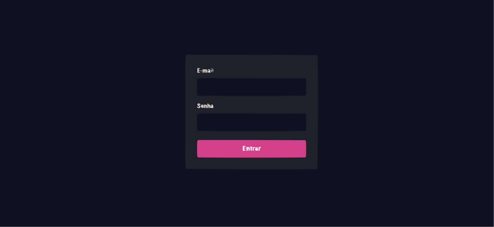
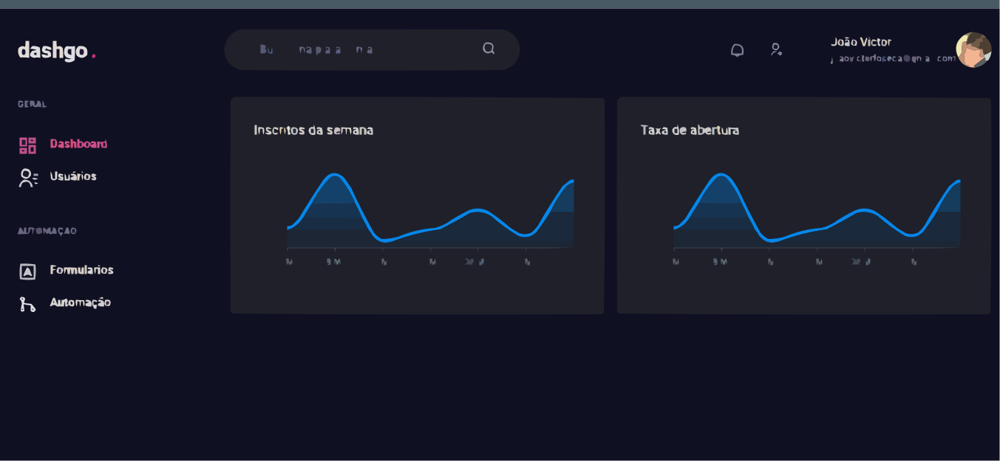

<h1 align="center"><svg xmlns="http://www.w3.org/2000/svg" version="1.1" width="121px" height="41px" style="shape-rendering:geometricPrecision; text-rendering:geometricPrecision; image-rendering:optimizeQuality; fill-rule:evenodd; clip-rule:evenodd" xmlns:xlink="http://www.w3.org/1999/xlink">
<g><path style="opacity:1" fill="#121225" d="M -0.5,-0.5 C 39.8333,-0.5 80.1667,-0.5 120.5,-0.5C 120.5,13.1667 120.5,26.8333 120.5,40.5C 80.1667,40.5 39.8333,40.5 -0.5,40.5C -0.5,26.8333 -0.5,13.1667 -0.5,-0.5 Z"/></g>
<g><path style="opacity:1" fill="#e2ddd5" d="M 19.5,5.5 C 21.1667,5.5 22.8333,5.5 24.5,5.5C 24.5,13.1667 24.5,20.8333 24.5,28.5C 20.601,27.8171 16.601,27.6504 12.5,28C 9.64026,24.3186 8.80693,20.1519 10,15.5C 12.4746,12.4764 15.4746,11.8097 19,13.5C 19.4974,10.854 19.6641,8.1873 19.5,5.5 Z"/></g>
<g><path style="opacity:1" fill="#e3dad3" d="M 56.5,5.5 C 58.1667,5.5 59.8333,5.5 61.5,5.5C 61.3359,8.1873 61.5026,10.854 62,13.5C 65.3937,11.7253 68.0604,12.392 70,15.5C 70.499,19.8206 70.6657,24.1539 70.5,28.5C 68.8333,28.5 67.1667,28.5 65.5,28.5C 65.5,24.5 65.5,20.5 65.5,16.5C 64.1667,16.5 62.8333,16.5 61.5,16.5C 61.5,20.5 61.5,24.5 61.5,28.5C 59.8333,28.5 58.1667,28.5 56.5,28.5C 56.5,20.8333 56.5,13.1667 56.5,5.5 Z"/></g>
<g><path style="opacity:1" fill="#dcdde1" d="M 28.5,12.5 C 32.2568,12.0708 35.7568,12.7375 39,14.5C 39.4992,19.1548 39.6658,23.8215 39.5,28.5C 36.7381,27.6473 34.0715,27.6473 31.5,28.5C 24.8089,27.2325 23.8089,24.0658 28.5,19C 30.5767,18.8078 32.5767,18.3078 34.5,17.5C 31.5535,16.6786 28.5535,16.1786 25.5,16C 26.7101,14.9609 27.7101,13.7942 28.5,12.5 Z"/></g>
<g><path style="opacity:1" fill="#e0dede" d="M 43.5,12.5 C 47.2568,12.0708 50.7568,12.7375 54,14.5C 54.4828,15.448 54.6495,16.448 54.5,17.5C 51.8431,17.838 49.5098,17.1713 47.5,15.5C 46.6143,16.325 46.281,17.325 46.5,18.5C 52.3771,18.2057 54.8771,20.8724 54,26.5C 50.7441,28.4285 47.2441,28.9285 43.5,28C 41.9632,26.8904 41.2965,25.3904 41.5,23.5C 44.3297,23.6941 46.9963,24.3608 49.5,25.5C 49.5,24.5 49.5,23.5 49.5,22.5C 41.8817,22.2522 39.8817,18.9189 43.5,12.5 Z"/></g>
<g><path style="opacity:1" fill="#dddfe2" d="M 75.5,12.5 C 79.315,13.1049 82.9817,13.1049 86.5,12.5C 86.6662,18.8421 86.4995,25.1754 86,31.5C 81.5632,35.2051 77.0632,35.3718 72.5,32C 73.0465,31.0754 73.7132,30.2421 74.5,29.5C 76.8392,30.724 79.1725,30.724 81.5,29.5C 73.7694,29.0184 70.6028,25.0184 72,17.5C 72.2572,15.0935 73.4238,13.4268 75.5,12.5 Z"/></g>
<g><path style="opacity:1" fill="#dddcde" d="M 91.5,12.5 C 100.657,11.4892 104.49,15.4892 103,24.5C 98.6248,29.3815 93.9581,29.7148 89,25.5C 86.4582,20.4379 87.2915,16.1046 91.5,12.5 Z"/></g>
<g><path style="opacity:1" fill="#141233" d="M 15.5,16.5 C 16.8221,16.33 17.9887,16.6634 19,17.5C 19.6667,19.5 19.6667,21.5 19,23.5C 17.6667,24.8333 16.3333,24.8333 15,23.5C 14.2967,21.0709 14.4634,18.7375 15.5,16.5 Z"/></g>
<g><path style="opacity:1" fill="#191126" d="M 77.5,16.5 C 78.8333,16.5 80.1667,16.5 81.5,16.5C 81.5,19.1667 81.5,21.8333 81.5,24.5C 76.6645,23.7913 75.3312,21.1246 77.5,16.5 Z"/></g>
<g><path style="opacity:1" fill="#251630" d="M 93.5,16.5 C 95.1439,16.2865 96.6439,16.6198 98,17.5C 98.7581,19.7695 98.5914,21.9361 97.5,24C 95.8876,24.7203 94.3876,24.5536 93,23.5C 92.2967,21.0709 92.4634,18.7375 93.5,16.5 Z"/></g>
<g><path style="opacity:1" fill="#141027" d="M 31.5,21.5 C 32.5,21.5 33.5,21.5 34.5,21.5C 34.5,22.5 34.5,23.5 34.5,24.5C 31.4331,24.8795 30.4331,23.8795 31.5,21.5 Z"/></g>
<g><path style="opacity:1" fill="#c03373" d="M 110.5,23.5 C 114.161,23.3501 115.161,24.8501 113.5,28C 112.207,28.49 110.873,28.6567 109.5,28.5C 109.366,26.7085 109.699,25.0418 110.5,23.5 Z"/></g>
</svg>
</h1>

 <a href="#objetivo">Objetivo</a> •
 <a href="#Fotos">Fotos</a> •
 <a href="#tecnologias">Tecnologias</a> •
 <a href="#autor">Autor</a>

<h4 align="center">
	🚧  dashgo. 🚀 Em construção...  🚧
</h4>

### objetivo
Essa aplicação é um Dashboard aonde é 100% responsivo usamos a biblioteca Chakra UI, uma interface  declarativa

### Fotos 

 

<h4>SignIn</h4>

 

<h4>Dashboard</h4>

 

<h4>Usuários</h4>

 

### 🛠 Tecnologias

As seguintes ferramentas foram usadas na construção do projeto:

- [React](https://pt-br.reactjs.org/)
- [TypeScript](https://www.typescriptlang.org/)
- [Chakra UI](https://chakra-ui.com//)

### Autor

<a href="https://github.com/joao-victor-fonseca">
 
  
 <b>João Victor Fonseca</b></a> <a href="https://github.com/joao-victor-fonseca" title="perfil">🚀</a>

Feito com ❤️ por João Victor Fonseca 👋🏽 Entre em contato!

